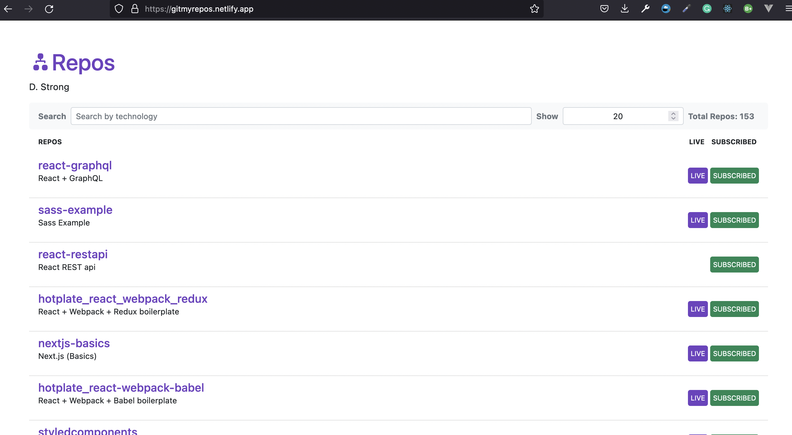

<div id="top"></div>

[![Contributors][contributors-shield]][contributors-url]
[![Forks][forks-shield]][forks-url]
[![Stargazers][stars-shield]][stars-url]
[![Issues][issues-shield]][issues-url]
[![MIT License][license-shield]][license-url]
[![LinkedIn][linkedin-shield]][linkedin-url]


<!-- PROJECT LOGO -->
<br />
<div align="center">
  <a href="https://github.com/derrickmstrong/react-graphql">
    
  </a>

<h2 align="center">React-GraphQL</h2>

  <p align="center">
    This is a React app which uses GraphQL to query my personal GitHub repo data from the GitHub API and is hosted via Netlify 
    <br />
    <a href="https://github.com/derrickmstrong/react-graphql"><strong>Explore the docs »</strong></a>
    <br />
    <br />
    <a href="https://gitmyrepos.netlify.app/" target="_blank">View Demo</a>
    ·
    <a href="https://github.com/derrickmstrong/react-graphql/issues">Report Bug</a>
    ·
    <a href="https://github.com/derrickmstrong/react-graphql/issues">Request Feature</a>
  </p>
</div>


<!-- TABLE OF CONTENTS -->
<details>
  <summary>Table of Contents</summary>
  <ol>
    <li>
      <a href="#about-the-project">About The Project</a>
      <ul>
        <li><a href="#built-with">Built With</a></li>
      </ul>
    </li>
    <li>
      <a href="#getting-started">Getting Started</a>
      <ul>
        <li><a href="#prerequisites">Prerequisites</a></li>
        <li><a href="#installation">Installation</a></li>
      </ul>
    </li>
    <!-- <li><a href="#usage">Usage</a></li> -->
    <!-- <li><a href="#roadmap">Roadmap</a></li> -->
    <li><a href="#contributing">Contributing</a></li>
    <li><a href="#license">License</a></li>
    <li><a href="#contact">Contact</a></li>
    <!-- <li><a href="#acknowledgments">Acknowledgments</a></li> -->
  </ol>
</details>


<!-- ABOUT THE PROJECT -->
## About The Project
This is a React app which uses GraphQL to query my personal GitHub repo data from the GitHub API and is hosted via Netlify
<!-- [![Product Name Screen Shot][product-screenshot]](https://example.com) -->

 <!-- `derrickmstrong`, `react-graphql`, `dmstr0ng`, `derrickmstrong`, `gmail`, `derrickmstrong`, `react-graphql`, `This is a React app which uses GraphQL to query my personal GitHub repo data from the GitHub API and is hosted via Netlify ` -->

<p align="right">(<a href="#top">back to top</a>)</p>


### Built With

<!-- * [Sass](https://sass-lang.com/) -->
<!-- * [Next.js](https://nextjs.org/) -->
* [React.js](https://reactjs.org/)
* [GraphQL](https://graphql.org/)
* [Bootstrap](https://getbootstrap.com)
<!-- * [Vue.js](https://vuejs.org/) -->
<!-- * [Angular](https://angular.io/) -->
<!-- * [Svelte](https://svelte.dev/) -->
<!-- * [Laravel](https://laravel.com) -->
<!-- * [JQuery](https://jquery.com) -->

<p align="right">(<a href="#top">back to top</a>)</p>


<!-- GETTING STARTED -->
## Getting Started

<!-- This is an example of how you may give instructions on setting up your project locally.
To get a local copy up and running follow these simple example steps. -->

### Prerequisites

To begin, be sure you have the latest version of npm.
* npm
  ```sh
  npm install npm@latest -g
  ```

### Installation

<!-- 1. Get a free API Key at [https://example.com](https://example.com) -->
1. Clone the repo
   ```sh
   git clone https://github.com/derrickmstrong/react-graphql.git
   ```
2. Install NPM packages
   ```sh
   npm install
   ```
<!-- 4. Enter your API in `config.js`
   ```js
   const API_KEY = 'ENTER YOUR API';
   ``` -->

<p align="right">(<a href="#top">back to top</a>)</p>


<!-- USAGE EXAMPLES -->
<!-- ## Usage

Use this space to show useful examples of how a project can be used. Additional screenshots, code examples and demos work well in this space. You may also link to more resources.

_For more examples, please refer to the [Documentation](https://example.com)_

<p align="right">(<a href="#top">back to top</a>)</p> -->


<!-- ROADMAP -->
<!-- ## Roadmap

- [ ] Feature 1
- [ ] Feature 2
- [ ] Feature 3
    - [ ] Nested Feature

See the [open issues](https://github.com/derrickmstrong/react-graphql/issues) for a full list of proposed features (and known issues).

<p align="right">(<a href="#top">back to top</a>)</p> -->


<!-- CONTRIBUTING -->
## Contributing

Contributions are what make the open source community such an amazing place to learn, inspire, and create. Any contributions you make are **greatly appreciated**.

If you have a suggestion that would make this better, please fork the repo and create a pull request. You can also simply open an issue with the tag "enhancement".
Don't forget to give the project a star! Thanks again!

1. Fork the Project
2. Clone the Project
3. Create your Feature Branch (`git checkout -b feature/AmazingFeature`)
4. Commit your Changes (`git commit -m 'Add some AmazingFeature'`)
5. Push to the Branch (`git push origin feature/AmazingFeature`)
6. Open a Pull Request

<p align="right">(<a href="#top">back to top</a>)</p>


<!-- LICENSE -->
## License

<!-- Distributed under the MIT License. -->
 See `LICENSE.txt` for more information.

<p align="right">(<a href="#top">back to top</a>)</p>


<!-- CONTACT -->
## Contact

Derrick Strong - [@dmstr0ng](https://twitter.com/dmstr0ng)

Project Link: [https://github.com/derrickmstrong/react-graphql](https://github.com/derrickmstrong/react-graphql)

<p align="right">(<a href="#top">back to top</a>)</p>


<!-- ACKNOWLEDGMENTS -->
<!-- ## Acknowledgments

* []()
* []()
* []()

<p align="right">(<a href="#top">back to top</a>)</p> -->


<!-- MARKDOWN LINKS & IMAGES -->
<!-- https://www.markdownguide.org/basic-syntax/#reference-style-links -->
[contributors-shield]: https://img.shields.io/github/contributors/derrickmstrong/react-graphql.svg?style=for-the-badge
[contributors-url]: https://github.com/derrickmstrong/react-graphql/graphs/contributors
[forks-shield]: https://img.shields.io/github/forks/derrickmstrong/react-graphql.svg?style=for-the-badge
[forks-url]: https://github.com/derrickmstrong/react-graphql/network/members
[stars-shield]: https://img.shields.io/github/stars/derrickmstrong/react-graphql.svg?style=for-the-badge
[stars-url]: https://github.com/derrickmstrong/react-graphql/stargazers
[issues-shield]: https://img.shields.io/github/issues/derrickmstrong/react-graphql.svg?style=for-the-badge
[issues-url]: https://github.com/derrickmstrong/react-graphql/issues
[license-shield]: https://img.shields.io/github/license/derrickmstrong/react-graphql.svg?style=for-the-badge
[license-url]: https://github.com/derrickmstrong/react-graphql/blob/master/LICENSE.txt
[linkedin-shield]: https://img.shields.io/badge/-LinkedIn-black.svg?style=for-the-badge&logo=linkedin&colorB=555
[linkedin-url]: https://linkedin.com/in/derrickmstrong
[product-screenshot]: images/screenshot.png